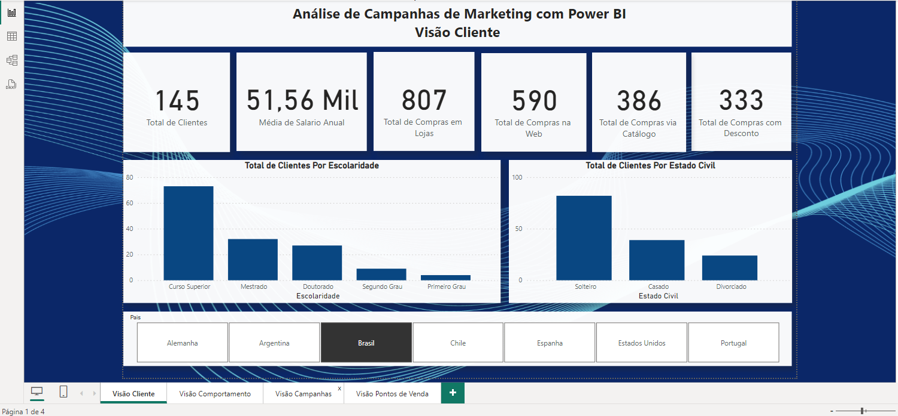
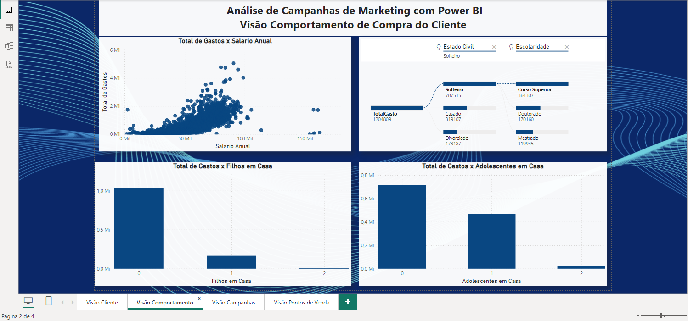
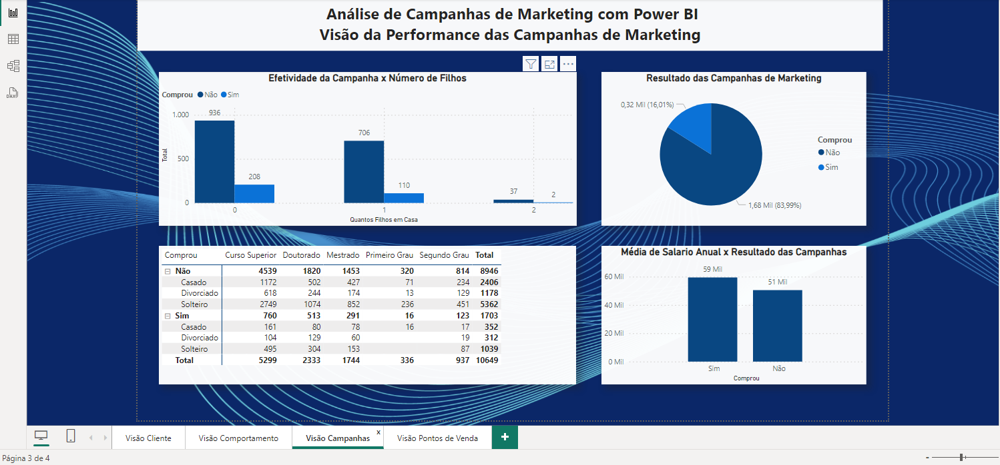
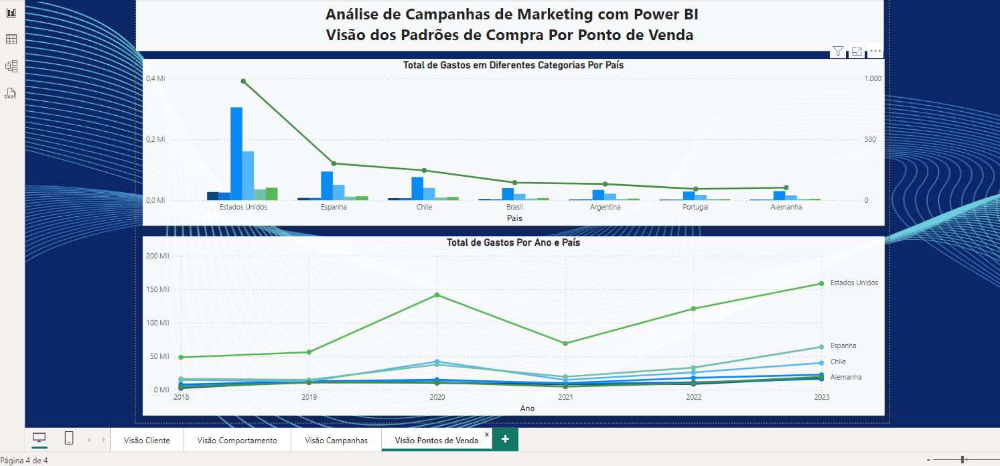

# Power BI para Análise de Dados de Marketing

## Projeto - Análise de Campanhas de Marketing 

## Objetivo

Para este projeto foi criado diversos relatórios divididos em 4 visões:

## • Visão do Cliente
## • Visão do Comportamento de Compra do Cliente
## • Visão da Performance das Campanhas de Marketing
## • Visão dos Padrões de Compra no Ponto de Venda (País)

## Como Utilizar

Cada visão que desenvolvi visa proporcionar uma compreensão profunda das variáveis envolvidas. Isso inclui a criação de gráficos impactantes, o cálculo de medidas significativas, a extração de métricas relevantes e a análise dos dados. 

 
 
 

