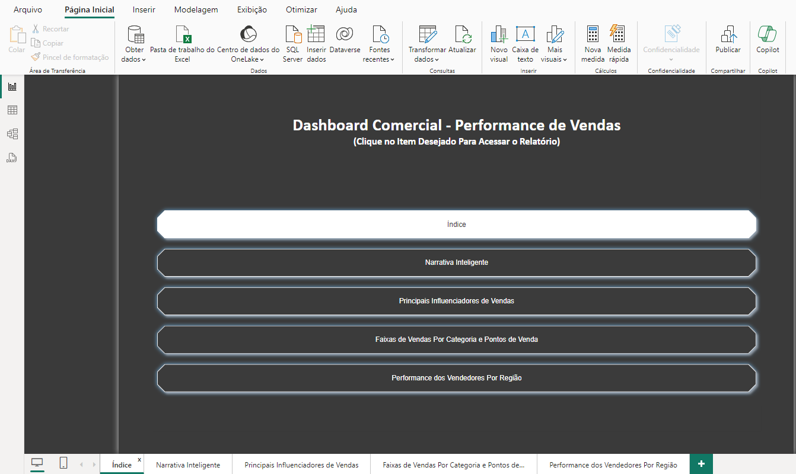
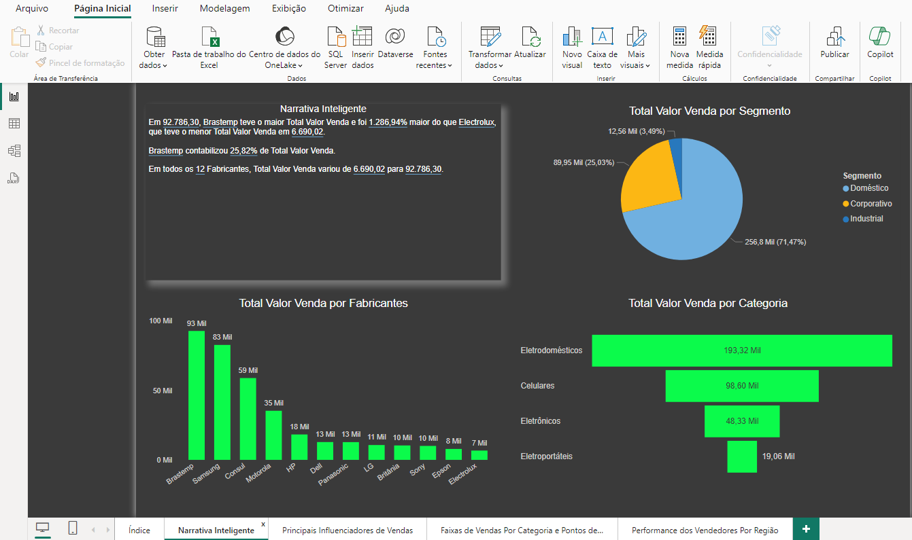
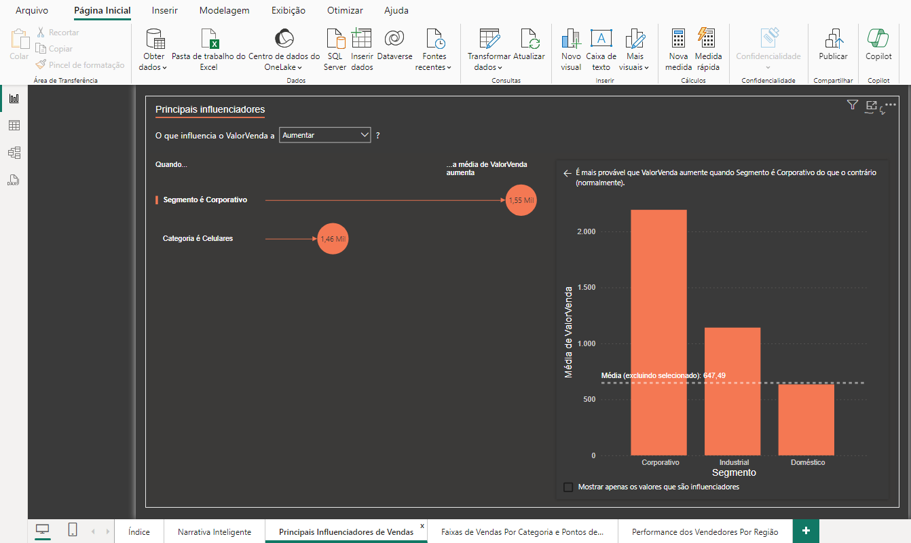
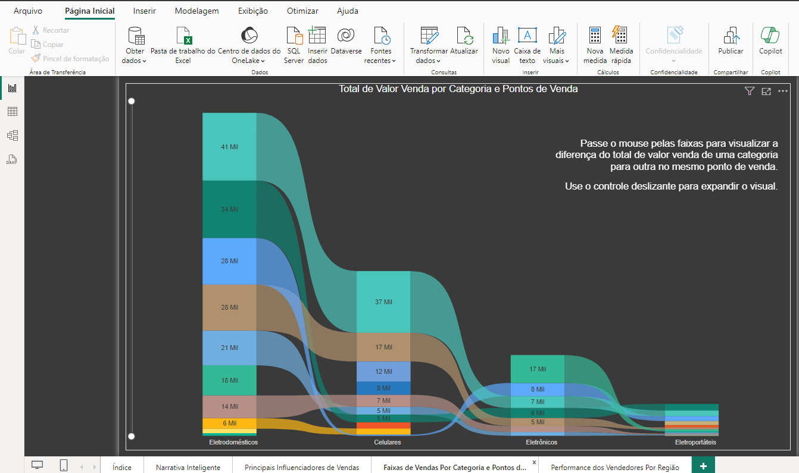
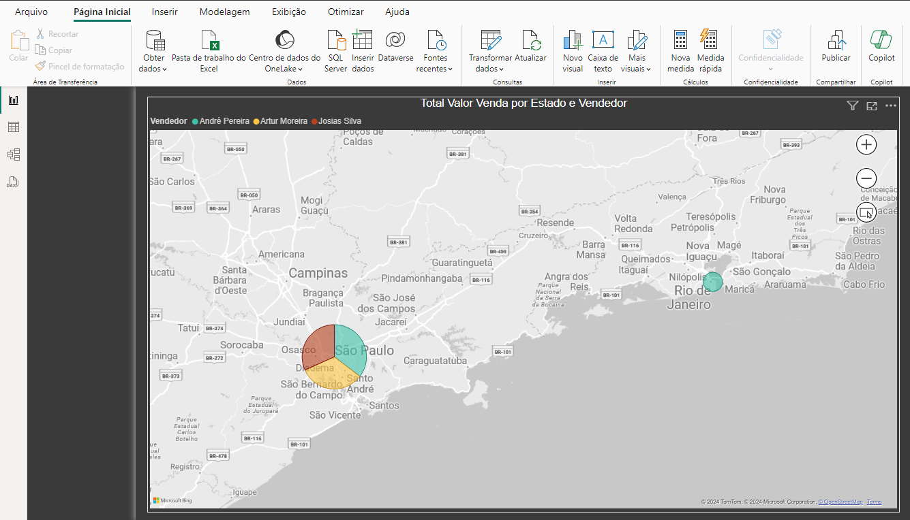

# Projeto - Análise de Dados Comerciais

Nesse projeto será apresentado recursos do Power BI como a Narrativa Inteligente, Principais Influenciadores, Gráfico de Faixas e criação de menu para índice do Dashboard.

## Objetivo

O objetivo deste projeto é fornecer um dashboard interativo que responda às seguintes perguntas:

- **Volume de vendas**: quantidade de produtos ou serviços vendidos.
- **Ticket médio**: valor médio das vendas por transação.
- **Taxa de conversão**: proporção de visitantes do site ou contatos que se tornam clientes.
- **Ciclo de vendas**: tempo médio que leva para fechar uma venda, desde o primeiro contato com o cliente até o fechamento.
- **Retenção de clientes**: taxa de clientes que compram novamente após a primeira compra.
- **Lucratividade**: receita líquida obtida pela venda de produtos ou serviços, descontados os custos.
- **Produtividade da equipe de vendas**: quantidade de vendas realizadas por vendedor por período.
- **Satisfação do cliente**: medida da satisfação dos clientes com a empresa, produtos e serviços oferecidos.

 
 
 
 
 
