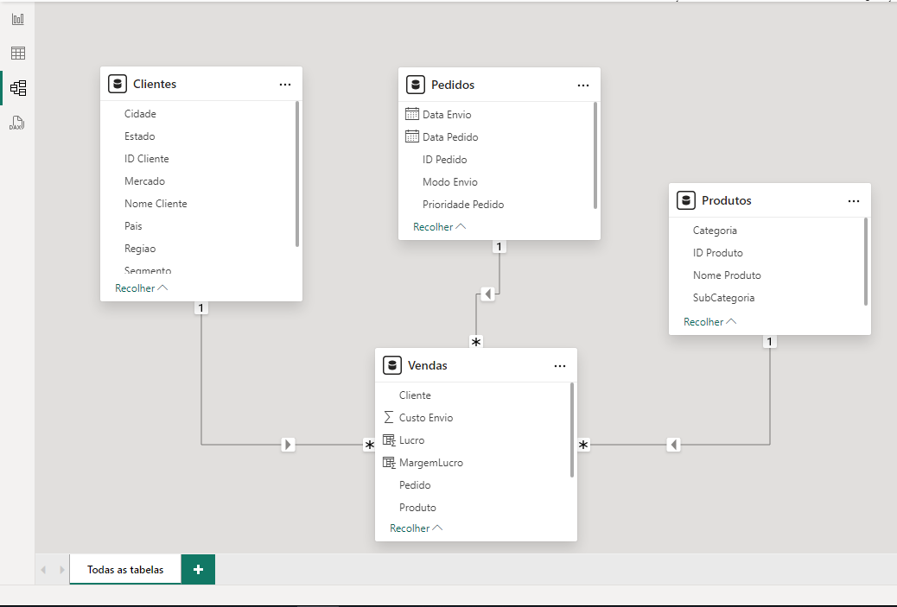
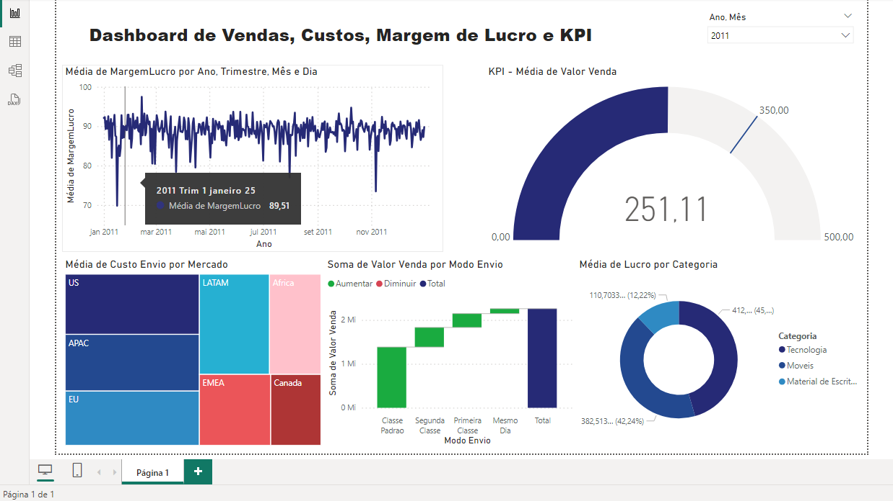

# Dashboard de Vendas, Custo, Margem de Lucro e KPI

## Objetivo

O objetivo deste projeto é fornecer um dashboard interativo que responda às seguintes perguntas:

- **Pergunta 1**: Qual foi o total de valor venda considerando cada modo de envio dos pedidos?
- **Pergunta 2**: Quais mercados tiveram o maior custo médio de envio dos produtos vendidos?
- **Pergunta 3**: A empresa tem como objetivo (meta) manter uma média de 350 para o valor de venda
todos os meses. Mostre um indicador (KPI – Key Performance Indicator) com o valor
médio de venda. A empresa ficou abaixo ou acima da meta no mês de Abril/2014?
- **Pergunta 4**: Considere que o lucro é equivalente a: valor venda - custo envio. Qual categoria de
produto apresentou maior lucro médio.
- **Pergunta 5**: Qual foi o comportamento da margem de lucro ao longo do tempo? Considere a
margem de lucro como o lucro dividido pelo valor venda.

## 
Este dashboard foi elaborado utilizando técnicas de modelagem de dados, considerando a cardinalidade e aplicando os recursos de limpeza de dados. Além disso, foi explorado uma breve introdução ao DAX, uma linguagem para análise e manipulação de dados.

